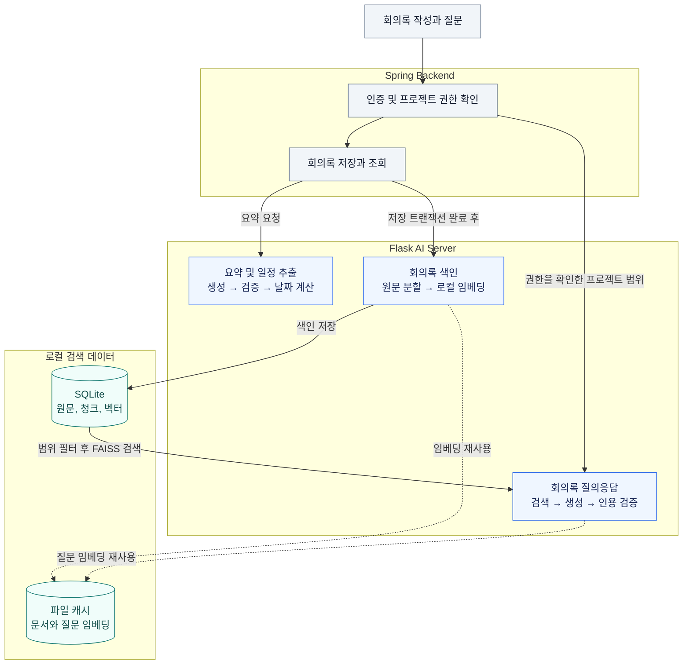
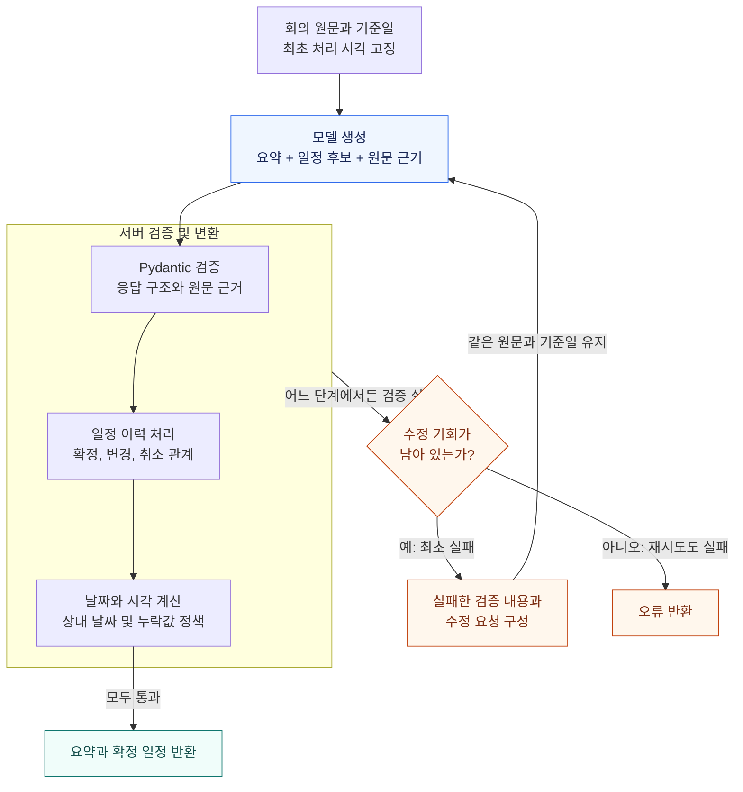
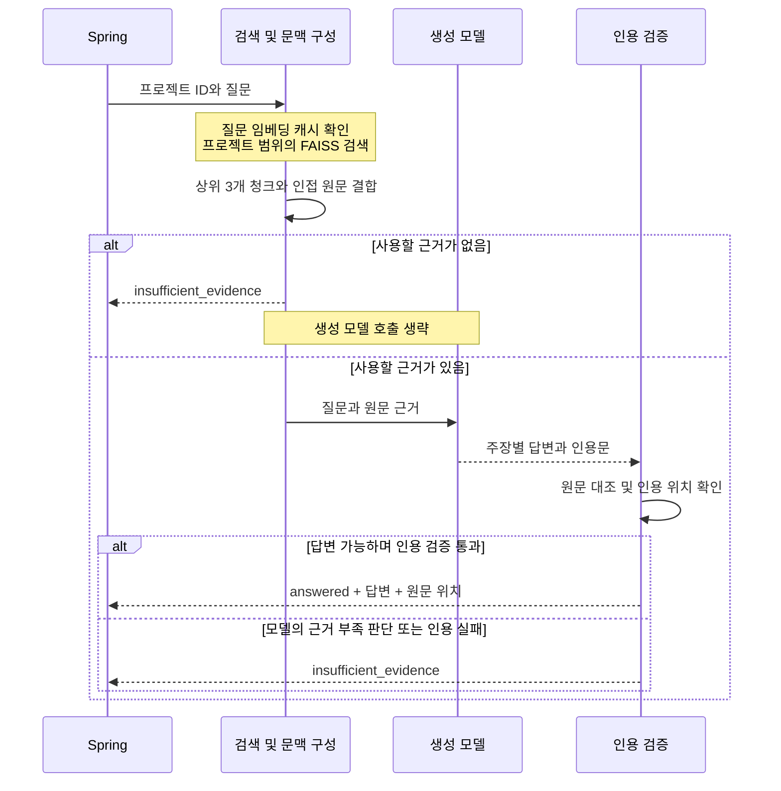

# Logmeet AI

Logmeet는 회의 내용을 요약하고 일정을 정리하는 회의록 관리 서비스입니다. 이 저장소는 음성과 이미지의 텍스트 변환, 회의 요약과 일정 추출, 저장된 회의록에 대한 질의응답을 담당합니다.

기존 Flask 서버의 모델 호출 기능을 바탕으로, 생성 결과를 검증하는 LangGraph 흐름과 프로젝트별 RAG를 추가했습니다. 회의에서 결정한 내용을 정리하고, 이후 질문에도 원문 근거를 함께 제공하는 것이 목표입니다.

[Spring Backend 저장소](https://github.com/KUFocus/Backend)

## 주요 기능

| 기능 | 처리 내용 |
| --- | --- |
| 회의 요약 | 핵심 문제, 결정, 제약과 미해결 쟁점을 정리합니다. 담당자가 명시된 후속 업무는 담당자와 수행 조건을 연결합니다. |
| 일정 추출 | 제안, 확정, 변경과 취소 이력을 구분하고 최종 확정된 일정을 반환합니다. |
| 회의록 색인 | 회의 원문을 나누어 로컬 모델로 임베딩하고, 프로젝트와 회의록 ID를 기준으로 저장합니다. |
| 회의록 질의응답 | 같은 프로젝트의 회의록에서 근거를 검색하고, 답변에 원문 인용과 위치를 함께 반환합니다. |
| 입력 변환 | Clova Speech API로 음성을, EasyOCR와 커스텀 모델을 사용하는 기존 이미지 처리 코드로 이미지를 텍스트로 변환합니다. |

## 처리 구조

사용자 인증과 프로젝트 접근 권한 확인은 Spring 서버가 담당합니다. AI 서버의 색인 및 질문 API는 Spring에서 호출하는 내부 API입니다.



그림은 텍스트 변환 이후의 처리와 저장 경계를 나타냅니다. 실선은 요청 또는 데이터 전달, 점선은 임베딩 캐시 사용을 뜻합니다. 요약 요청과 색인 요청은 별개이며, 색인은 Spring에서 회의록 저장이 완료된 뒤 수행합니다. 각 API의 결과는 요청한 Spring 서버로 반환합니다.


### 요약과 일정 추출

한 번의 생성 요청에서 요약과 일정 후보를 함께 받습니다. 모델은 원문의 의사결정과 근거를 추출하고, 서버는 응답 형식과 근거 연결을 검사한 뒤 날짜와 시각을 계산합니다.



파란 상자는 생성 모델 호출, 주황색 경로는 검증 실패 처리를 나타냅니다. 검증 단계를 하나의 영역으로 묶어 표시했으며, 실제 코드에서는 스키마 검증, 이력 처리, 날짜 계산과 시각 계산이 각각 실행됩니다.


Pydantic으로 모델 응답의 구조를 검사하고 원문 근거를 연결합니다. 검증 실패 시 오류 내용을 다음 생성 요청에 전달하며, 재시도에도 최초 처리 시각을 유지합니다. 그래프의 생성 시도는 최대 2회로 제한합니다.

일정의 날짜와 시각에는 다음 정책을 적용합니다.

- `meetingDate`가 있으면 해당 날짜를, 없으면 한국 시간 기준 최초 처리일을 사용합니다.
- 날짜만 있으면 시각을 `18:00`으로 보완합니다. 날짜 없이 시각만 있으면 기준일을 적용합니다.
- 날짜와 시각이 모두 없으면 일정 저장 대상에서 제외합니다.
- 명시된 오전과 오후를 우선합니다. 오전과 오후가 없는 한글 시각은 1~7시를 오후, 8~11시를 오전, 12시를 정오로 해석합니다.
- 이미 지난 시각을 자동으로 다음 날로 옮기지 않습니다.

관련 코드: [생성 요청](summarization.py), [LangGraph 흐름](summary_workflow.py), [응답 검증](summary_schema.py), [일정 이력](schedule_history.py), [날짜와 시각 계산](schedule_tools.py)

### 회의록 색인과 검색

검색 대상은 요약문이 아닌 **회의 원문**입니다. 요약 과정에서 생략된 조건이나 논의도 질문의 근거로 사용할 수 있도록 원문을 보존합니다.

1. `RecursiveCharacterTextSplitter`로 원문을 나눕니다. 화자 이름이나 특정 대화 형식을 전제로 하지 않습니다.
2. `multilingual-e5-small`로 문서를 로컬에서 임베딩합니다. 문서에는 `passage:`, 질문에는 `query:` 접두사를 사용합니다.
3. 원문, 청크, 원문 위치와 벡터를 SQLite에 저장합니다.
4. 검색 시 프로젝트 범위에 해당하는 벡터로 FAISS `IndexFlatIP`를 구성합니다. 특정 회의록으로 검색 범위를 좁힐 수도 있습니다.

청크는 모델의 512 토큰 한도에 맞추고 64 토큰의 겹침을 둡니다. 검색 후에는 적중한 청크의 앞뒤 청크를 함께 읽고 겹치는 구간을 합쳐 문맥을 구성합니다.

`CacheBackedEmbeddings`는 문서와 질문의 임베딩을 파일에 캐시합니다. 모델 리비전과 임베딩 설정을 캐시 구분에 포함해 서로 다른 설정의 벡터가 섞이지 않도록 했습니다. 원문 해시와 처리 버전이 같은 회의록은 재색인도 생략합니다.

SQLite가 데이터를 영속 저장하고 FAISS가 벡터 검색을 수행합니다. 현재는 요청마다 검색 범위의 FAISS 인덱스를 메모리에 구성하는 소규모 로컬 실행 구조입니다.

관련 코드: [청크 분할](meeting_chunks.py), [로컬 임베딩](meeting_embeddings.py), [임베딩 캐시](meeting_embedding_cache.py), [색인과 검색](meeting_index.py)

### 근거를 함께 반환하는 질의응답

질문 처리에서는 **생성 전에 검색 근거가 있는지**, **생성 후 인용이 유효한지**를 구분해 검사합니다.



참여자는 처리 책임을 나타냅니다. 검색과 인용 검증은 같은 AI 서버 내부에서 실행되며, 답변 생성에는 별도의 모델 API를 호출합니다.

답변에는 주장별 인용문, 회의록 ID, 원문 해시와 문자 위치가 포함됩니다. 서버는 인용문이 검색한 원문에 실제로 존재하는지 검사합니다. 검색 결과가 없으면 생성 모델을 호출하지 않고, 근거가 부족하거나 인용 검증에 실패하면 `insufficient_evidence`를 반환합니다.

인용 검증은 원문 위치와 문구의 일치를 확인합니다. 인용문이 답변의 의미를 충분히 뒷받침하는지까지 보장하는 검사는 아닙니다. 현재 흐름에는 모델이 추가 검색 여부를 선택하는 자율 재검색이 포함되어 있지 않습니다.

관련 코드: [질의응답 그래프](meeting_answer_workflow.py), [문맥 구성과 인용 검증](meeting_answers.py)

## 기술과 선택 이유

| 기술 | 적용 위치와 이유 |
| --- | --- |
| Flask | Spring에서 호출하는 AI 처리 API를 제공합니다. |
| LangGraph | 생성, 검증, 수정 요청과 답변 보류를 상태 및 조건 분기로 관리합니다. |
| Pydantic | 요청과 모델 응답의 구조를 검사하고 검증 오류를 구체화합니다. |
| LangChain | 문서 분할과 임베딩 캐시에 기존 구성 요소를 사용합니다. |
| multilingual-e5-small | 한국어 회의록과 질문을 로컬에서 임베딩해 임베딩 API 호출 비용을 없앱니다. |
| SQLite와 FAISS | 별도 데이터베이스 서버 없이 원문과 벡터를 보관하고 유사도 검색을 수행합니다. |
| OpenAI API | 회의 요약, 일정 후보 추출과 검색 근거 기반 답변 생성을 담당합니다. |

생성 모델 기본값은 코드의 `gpt-6-luna`입니다. 모델 설정은 [summary_model.py](summary_model.py)와 [meeting_answers.py](meeting_answers.py)에서 확인할 수 있습니다. 실제 실행에는 해당 모델을 사용할 수 있는 API 환경이 필요합니다.

## 내부 API

| 메서드 | 경로 | 입력 | 역할 |
| --- | --- | --- | --- |
| POST | `/process_audio` | `filePath` | 음성 파일의 텍스트 변환 |
| POST | `/process_image` | `filePath` | 이미지 파일의 텍스트 변환 |
| POST | `/summarize_text` | `text`, 선택 `meetingDate` | 요약과 일정 추출 |
| POST | `/index_meeting` | `projectId`, `minutesId`, `text` | 회의록 색인 |
| DELETE | `/index_meeting` | `projectId`, `minutesId` | 색인 삭제 |
| POST | `/answer_meeting` | `projectId`, `question`, 선택 `minutesId` | 근거 기반 질의응답 |

예를 들어 프로젝트에 저장된 회의록에서 배포 일정의 변경 내용을 질문할 수 있습니다.

```json
{
  "projectId": 1,
  "question": "배포 일정이 언제로 변경됐고 어떤 조건이 붙었어?"
}
```

`minutesId`를 생략하면 해당 프로젝트의 회의록들을 검색합니다. 이 ID들은 인증 수단이 아니므로, 사용자 요청은 Spring의 권한 검사를 거쳐야 합니다.

## 로컬 실행 준비

현재 저장소의 `requirements.txt`는 기존 OCR 및 STT 서버의 의존성을 담고 있습니다. 요약 검증과 RAG에 사용하는 추가 의존성이 모두 반영되어 있지는 않아, 이 파일만 설치하는 것으로 전체 실행 환경이 완성되지는 않습니다.

추가로 Pydantic 2, LangGraph, `langchain-text-splitters`, `langchain-classic`, Transformers와 `faiss-cpu` 등이 필요합니다. 패키지 간 호환 버전을 맞춘 환경에서 실행해야 합니다.

| 환경 변수 | 용도 |
| --- | --- |
| `OPENAI_API_KEY` | 요약과 답변 생성 API 인증 |
| `CLOVA_SPEECH_INVOKE_URL` | 기존 STT API 주소 |
| `CLOVA_SPEECH_API_KEY` | 기존 STT API 인증 |
| `MEETING_EMBEDDING_MODEL_DIR` | 로컬 임베딩 모델 디렉터리 |
| `MEETING_EMBEDDING_REVISION` | 모델 리비전의 40자리 커밋 해시 |
| `MEETING_INDEX_DATABASE` | SQLite 색인 파일 경로 |

로컬 임베딩 모델은 실행 전에 준비해야 합니다. 모델 디렉터리의 `model-info.json`에는 `model`과 `revision`을 기록하며, 서버는 모델명이 `intfloat/multilingual-e5-small`인지와 설정한 리비전이 일치하는지 확인합니다. 런타임에서 모델을 자동으로 내려받지는 않습니다.

`app.py`는 시작 시 기존 OCR 모델도 로드합니다. OCR 모델 파일과 위 실행 환경을 준비한 뒤 저장소 루트에서 실행합니다.

```bash
python app.py
```

현재 진입점은 포트 `5001`의 Flask 개발 서버입니다. 로컬 개발과 검증을 위한 설정이며, 운영 배포 설정은 별도로 준비해야 합니다.

## 검증 범위

[tests](tests)에는 일정 변경 및 취소, 날짜와 시각 보완, 응답 검증, 청크 분할, 임베딩 캐시, 프로젝트별 검색 범위, 색인 삭제와 인용 검증을 다루는 테스트가 있습니다. 생성 모델을 대체하는 고정 응답을 사용해 API 비용 없이 처리 규칙을 확인하는 테스트도 포함합니다.

기능 테스트는 코드가 정한 규칙을 지키는지 확인합니다. 실제 회의에서의 추출 정확도, 요약 품질과 검색 품질은 별도의 데이터 평가가 필요합니다. 모델 변경 효과와 검증 흐름의 효과를 구분하기 위해 같은 입력과 같은 채점 기준으로 비교하는 것을 평가 원칙으로 삼습니다.
